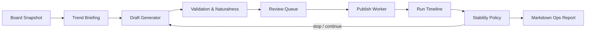

# Ghost Protocol

Ghost Protocol is a local-first operations cockpit for board trend reading, draft rehearsal, publishing workflow supervision, and run diagnostics. It is built around one practical idea: make long-running AI-assisted workflows inspectable, interruptible, and easy to review.

The project combines a Streamlit control surface, prompt assets, board collection utilities, draft quality checks, rehearsal loops, and operational reports into one workspace.


## Highlights

- **Board intelligence workspace**: collect board snapshots, summarize active themes, preserve raw source context, and export review packages.
- **Draft rehearsal loop**: run multi-cycle rehearsals, inspect how topics drift, and tune persona/prompt behavior before publishing.
- **Operator-first UI**: three-panel layout with execution context, current work area, and long-form logs.
- **Stability layer**: automatic stop recommendations for local-runtime outages, empty source data, repeated bad generations, publish failures, and suspicious feedback signals.
- **One-click reports**: copy board logs, briefing, generation logs, source posts, drafts, failed candidates, and diagnostics as Markdown.
- **Tested modules**: focused domain and application tests for prompts, naturalness checks, board rhythm, throttling, observability, and stability policy.

## Quick Start

```powershell
python -m venv .venv
.\.venv\Scripts\Activate.ps1
pip install -r requirements.txt
if (-not (Test-Path .env)) { Copy-Item .env.example .env }
```

2026-09-06부터 기본 추론은 기존 Gemini API 방식입니다. 로컬 `.env`에 키를 설정합니다.
기존 키가 있으면 보존하며, 키를 저장소나 로그에 넣지 않습니다.

```dotenv
LLM_PROVIDER=gemini
GEMINI_API_KEY=your-key
GEMINI_MODEL_NAME=gemini-2.5-flash
GEMINI_TIMEOUT_SEC=90
```

Run the app.

```powershell
streamlit run app.py
```

API 모드에서는 기존 `prompts/generate_post.txt` 전체와 선택 페르소나를 전달합니다.
로컬용 카드·축약 프롬프트·compact 재생성은 사용하지 않습니다. API 호출은 원문 분석
자료와 작문 지시를 Google에 전송합니다. 수집 보호·로컬 DB·검토 후 게시 흐름은 유지합니다.
화면의 '설정됨'은 키 존재 확인이며 연결·할당량 검증 성공을 뜻하지 않습니다.
일반 화면 재실행은 API를 호출하지 않습니다.

API 오류에 따른 모델·업체 자동 전환은 없습니다. 과거 Ollama 어댑터는
`LLM_PROVIDER=ollama`로 명시한 경우에만 사용되며 설치 파일은 보존합니다.
가격과 후보: [API 모델 비교](docs/api-model-shortlist.md).

## Project Shape

```text
ghost_protocol/
  application/      # Workers, exports, observability, stability policy
  domain/           # Draft guidance, naturalness, validation, board rhythm
  ui/               # Streamlit view helpers and session state
  brain.py          # Gemini API orchestration / explicit provider contract
  scraper.py        # Board collection utilities
  poster.py         # Publishing workflow automation
prompts/            # Prompt assets, personas, gallery profiles
tests/              # Unit tests for extracted modules
docs/               # Project documentation
```

## Architecture



## Operational Safety

Ghost Protocol keeps runtime-sensitive data out of source control. Do not commit `.env`, account files, browser sessions, local databases, generated logs, or run ledgers.

The app also includes operational guardrails:

- API configuration checks, request budgets, and actual token usage diagnostics.
- Publish failure thresholds.
- Infinite-run cycle caps.
- Empty-source detection.
- Comment-feedback monitoring for already published drafts.
- Manual stop and reset controls.

Use it only in environments where you have permission to collect data and automate workflows, and respect the rules of every service you interact with.

## Tests

```powershell
python -m pytest -q
```

Run the command above before publishing or deploying changes. The suite is
intentionally kept fast enough for routine local verification.
