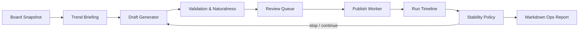

# Ghost Protocol

Ghost Protocol은 자료를 읽고 원고를 만들고 검토하는 로컬 편집 스튜디오입니다. 화면, 실행 워커, 저장 상태를 분리해 메뉴 이동이나 새로고침 때문에 작업이 다시 실행되지 않게 했습니다.

2026-09-06 재설계: 작업실 / 페르소나·규칙 / 실험실 / 운영 기록 / 설정. 기존 고급 운영은 별도 콘솔로 보존했습니다. 클라우드 Web Studio나 GitHub Pages 배포가 아닙니다.


## Highlights

- **Board intelligence workspace**: collect board snapshots, summarize active themes, preserve raw source context, and export review packages.
- **Draft rehearsal loop**: run multi-cycle rehearsals, inspect how topics drift, and tune persona/prompt behavior before publishing.
- **Editorial UI**: 자료 준비 → 분석 확인 → 원고 제작 → 비교·수정 → 게시 승인. 원고와 근거를 나란히 보고, 최신 승인 버전만 내보냅니다.
- **Persistent workspaces**: 로컬 SQLite에 작업·원본·원고 수정 이력·승인·호출별 사용량을 보존합니다. 파싱 실패와 수집 차단은 생성 중단 조건입니다.
- **Stability layer**: automatic stop recommendations for local-runtime outages, empty source data, repeated bad generations, publish failures, and suspicious feedback signals.
- **One-click reports**: copy board logs, briefing, generation logs, source posts, drafts, failed candidates, and diagnostics as Markdown.
- **Tested modules**: focused domain and application tests for prompts, naturalness checks, board rhythm, throttling, observability, and stability policy.

## Quick Start

```powershell
python -m venv .venv
.\.venv\Scripts\Activate.ps1
pip install -r requirements.txt
if (-not (Test-Path .env)) { Copy-Item .env.example .env }
```

2026-09-06부터 기본 추론은 기존 Gemini API 방식입니다. 로컬 `.env`에 키를 설정합니다.
기존 키가 있으면 보존하며, 키를 저장소나 로그에 넣지 않습니다.

```dotenv
LLM_PROVIDER=gemini
GEMINI_API_KEY=your-key
GEMINI_MODEL_NAME=gemini-2.5-flash
GEMINI_TIMEOUT_SEC=90
```

Run the app.

```powershell
streamlit run app.py
```

새 스튜디오 기본 모델은 사용자가 선택한 **`gemini-3.1-flash-lite`**입니다.
설정 화면에서 2.5 Flash로 바꿀 수 있습니다. 위 `.env`의 `GEMINI_MODEL_NAME`은
기존 콘솔·CLI 설정이며, 새 스튜디오의 모델 선택은 별도로 저장됩니다.

브라우저에서 `http://127.0.0.1:8501`을 엽니다. 직접 자료 입력 → API 분석 → 분석 확인
→ 페르소나 선택·생성 → 수정·승인 순서입니다. API 작업에는 명시적 실행 동의가 필요합니다.
실험실에서 이미 생성된 합성 원고 10쌍을 추가 호출 없이 비교·가져올 수 있습니다.

새 데이터는 `data/studio/studio.sqlite3`에 저장합니다. 기존 DB·계정 세션·원본 프롬프트는
바꾸지 않습니다. 미저장 편집은 현재 브라우저 세션의 메뉴 이동 동안만 유지되므로
새로고침 전에 저장하세요. 업데이트 후에는 실행 중인 작업을 마치고 앱을 재시작하세요.

API 모드에서는 기존 `prompts/generate_post.txt` 전체와 선택 페르소나를 전달합니다.
로컬용 카드·축약 프롬프트·compact 재생성은 사용하지 않습니다. API 호출은 원문 분석
자료와 작문 지시를 Google에 전송합니다. 수집 보호·로컬 DB·검토 후 게시 흐름은 유지합니다.
화면의 '설정됨'은 키 존재 확인이며 연결·할당량 검증 성공을 뜻하지 않습니다.
일반 화면 재실행은 API를 호출하지 않습니다.

API 오류에 따른 모델·업체 자동 전환은 없습니다. 과거 Ollama 어댑터는
`LLM_PROVIDER=ollama`로 명시한 경우에만 사용되며 설치 파일은 보존합니다.
가격과 후보: [API 모델 비교](docs/api-model-shortlist.md).

승인은 게시가 아닙니다. 새 작업실은 승인본 Markdown/JSON 저장과 수동 글쓰기 링크만
제공합니다. 무한 실행·리허설·자동 게시·댓글 감시는 운영 기록 → 기존 운영 콘솔
(`?legacy=1`)에 보존되어 있고 새 작업실 승인과 연결되지 않습니다. 두 콘솔의 외부 작업을
동시에 실행하지 마세요. 상세 범위·설계·검증은 [스튜디오 재설계](docs/studio-redesign.md)를 참고하세요.

## Project Shape

```text
ghost_protocol/
  application/      # Workers, exports, observability, stability policy
  domain/           # Draft guidance, naturalness, validation, board rhythm
  ui/               # Streamlit view helpers and session state
  studio/           # New editorial UI / durable commands / store / adapters
  brain.py          # Gemini API orchestration / explicit provider contract
  scraper.py        # Board collection utilities
  poster.py         # Publishing workflow automation
prompts/            # Prompt assets, personas, gallery profiles
tests/              # Unit tests for extracted modules
docs/               # Project documentation
```

## Architecture

새 작업실은 `app.py → studio.ui → StudioService → StudioStore / StudioBackend`로
분리했습니다. UI 재실행은 저장된 상태를 읽고, 사용자의 실행 명령만 워커를 시작합니다.
아래 도식의 자동 게시·피드백 루프는 보존된 기존 콘솔 범위입니다.



## Operational Safety

Ghost Protocol keeps runtime-sensitive data out of source control. Do not commit `.env`, account files, browser sessions, local databases, generated logs, or run ledgers.

The app also includes operational guardrails:

- API configuration checks, request budgets, and actual token usage diagnostics.
- Publish failure thresholds.
- Infinite-run cycle caps.
- Empty-source detection.
- Comment-feedback monitoring for already published drafts.
- Manual stop and reset controls.

Use it only in environments where you have permission to collect data and automate workflows, and respect the rules of every service you interact with.

## Tests

```powershell
python -m pytest -q
```

Run the command above before publishing or deploying changes. The suite is
intentionally kept fast enough for routine local verification.
