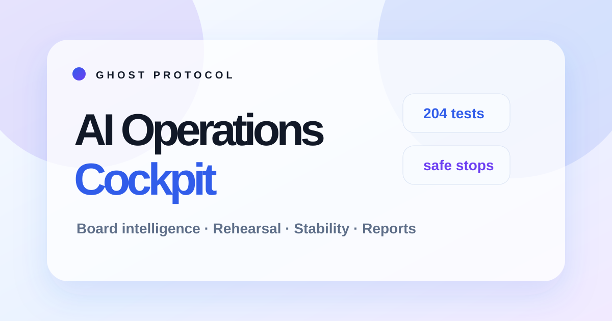
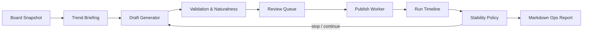

# Ghost Protocol

Ghost Protocol is a local-first operations cockpit for board trend reading, draft rehearsal, publishing workflow supervision, and run diagnostics. It is built around one practical idea: make long-running AI-assisted workflows inspectable, interruptible, and easy to review.

The project combines a Streamlit control surface, prompt assets, board collection utilities, draft quality checks, rehearsal loops, and operational reports into one workspace.



## Highlights

- **Board intelligence workspace**: collect board snapshots, summarize active themes, preserve raw source context, and export review packages.
- **Draft rehearsal loop**: run multi-cycle rehearsals, inspect how topics drift, and tune persona/prompt behavior before publishing.
- **Operator-first UI**: three-panel layout with execution context, current work area, and long-form logs.
- **Stability layer**: automatic stop recommendations for quota issues, empty source data, repeated bad generations, publish failures, and suspicious feedback signals.
- **One-click reports**: copy board logs, briefing, generation logs, source posts, drafts, failed candidates, and diagnostics as Markdown.
- **Tested modules**: focused domain and application tests for prompts, naturalness checks, board rhythm, throttling, observability, and stability policy.

## Quick Start

```powershell
python -m venv .venv
.\.venv\Scripts\Activate.ps1
pip install -r requirements.txt
Copy-Item .env.example .env
```

Add your Gemini key to `.env`.

```dotenv
GEMINI_API_KEY=your_key_here
```

Run the app.

```powershell
streamlit run app.py
```

## Project Shape

```text
ghost_protocol/
  application/      # Workers, exports, observability, stability policy
  domain/           # Draft guidance, naturalness, validation, board rhythm
  ui/               # Streamlit view helpers and session state
  brain.py          # Gemini-facing orchestration
  scraper.py        # Board collection utilities
  poster.py         # Publishing workflow automation
prompts/            # Prompt assets, personas, gallery profiles
tests/              # Unit tests for extracted modules
docs/               # Project documentation
```

## Architecture



## Operational Safety

Ghost Protocol keeps runtime-sensitive data out of source control. Do not commit `.env`, account files, browser sessions, local databases, generated logs, or run ledgers.

The app also includes operational guardrails:

- Gemini quota and billing diagnostics.
- Publish failure thresholds.
- Infinite-run cycle caps.
- Empty-source detection.
- Comment-feedback monitoring for already published drafts.
- Manual stop and reset controls.

Use it only in environments where you have permission to collect data and automate workflows, and respect the rules of every service you interact with.

## Tests

```powershell
python -m pytest -q
```

Run the command above before publishing or deploying changes. The suite is
intentionally kept fast enough for routine local verification.

## GitHub Pages

The landing page lives in `docs/`. Enable GitHub Pages with the included workflow when the repository visibility and GitHub plan support Pages, or serve it locally by opening:

```text
docs/index.html
```
